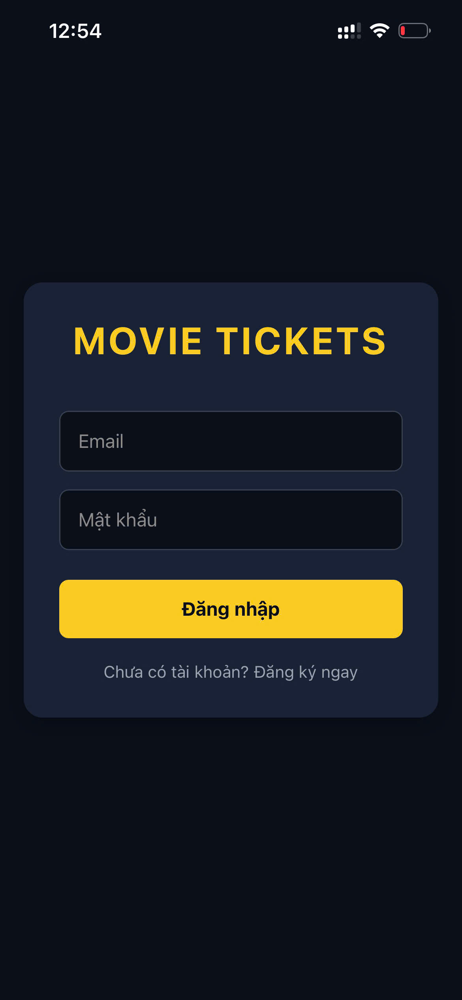
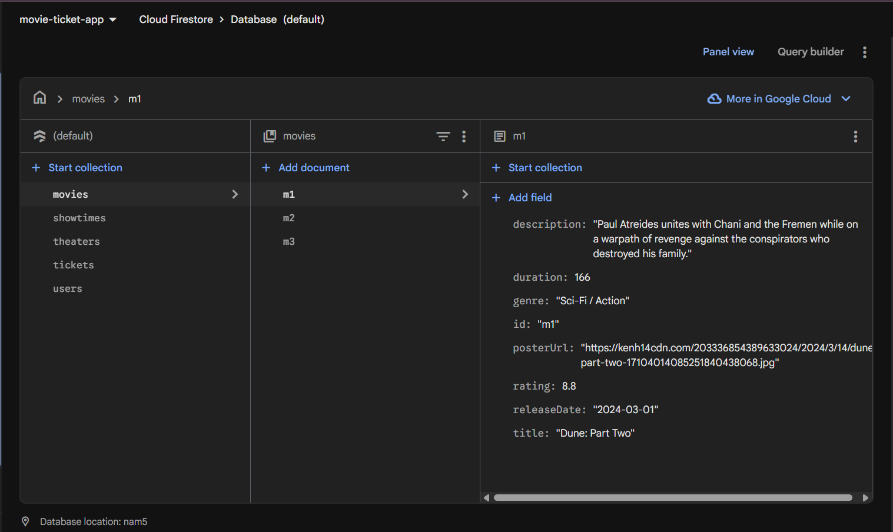
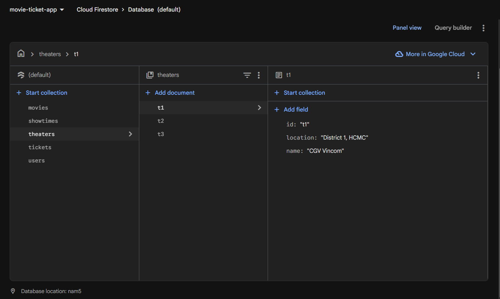
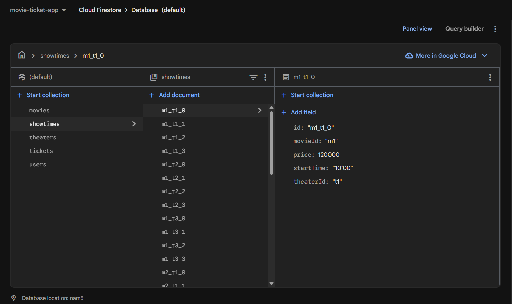
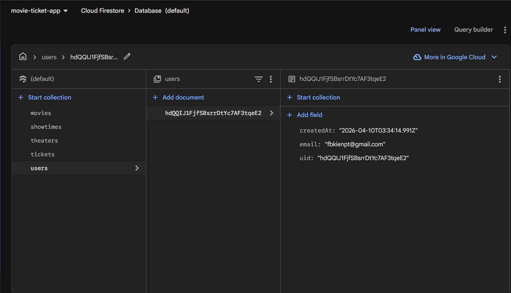
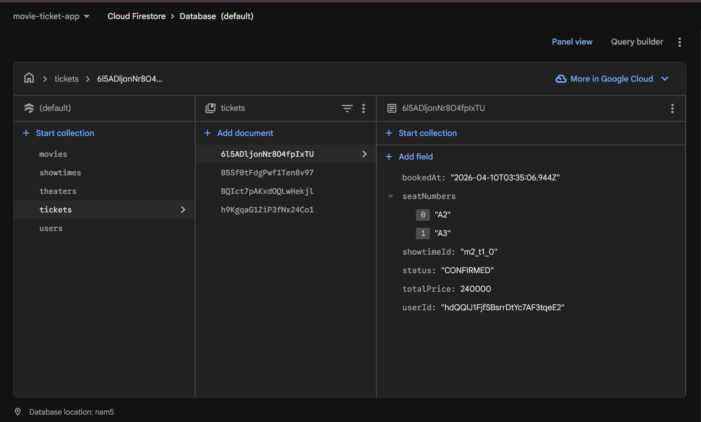

# Movie Ticket App

Ứng dụng Movie Ticket App được xây dựng với React Native (Expo) và Firebase, hỗ trợ chức năng đăng nhập, xem danh sách phim, đặt ghế và gửi thông báo mua vé.

Dưới đây là một số hình ảnh demo trực quan về các tính năng của ứng dụng cùng với cấu trúc cơ sở dữ liệu trên Firebase.

## 📱 Giao diện Ứng dụng (App UI)

### 1. Màn hình Đăng nhập (Login)
Màn hình xác thực người dùng sử dụng Firebase Authentication. Người dùng có thể Đăng nhập hoặc Đăng ký tài khoản bằng Email và Mật khẩu. Giao diện được thiết kế với phong cách Dark Theme nổi bật.

### 2. Danh sách Phim (Movie List)
Trang chủ hiển thị danh sách các bộ phim đang được chiếu tại rạp. Dữ liệu được fetch trực tiếp (real-time) từ Firestore.

### 3. Chi tiết Phim (Movie Detail)
Màn hình hiển thị thông tin chi tiết của phim (thời lượng, đánh giá, thể loại, mô tả) và danh sách các suất chiếu được phân loại theo rạp (Theaters).

### 4. Đặt ghế (Select Seat)
Sơ đồ ghế ngồi theo layout trực quan cho phép người dùng chọn số lượng ghế tùy ý. Tự động tính toán tổng tiền thanh toán dựa trên số ghế đang chọn.

### 5. Ghế đã đặt bị vô hiệu hóa (Disabled Seat Selected)
Những ghế nào đã được thanh toán và lưu vào Firestore sẽ tự động chuyển màu tối (opacity) và bị vô hiệu hóa, không cho các người dùng khác ấn vào chọn đè lên.

### 6. Thông báo mua vé (Buy Ticket Notification)
Ngay sau khi thanh toán thành công, hệ thống gửi thông báo (Local Push Notification bằng Expo Notifications) chớp nổi trên màn hình báo cáo trạng thái mã đặt vé và số ghế.

### 7. Vé của tôi (List Ticket)
Trang danh sách các vé đã đặt, truy xuất theo mã User ID từ Firebase để cá nhân hóa chỉ hiện vé của người đang dùng.

---

## 🗄️ Cấu trúc CSDL Firebase (Firestore Architecture)

Dưới đây là cấu trúc các Collection được mô phỏng trên Firebase Firestore để cấp dữ liệu cho ứng dụng.

### 1. Phim (Movies Collection)
Lưu trữ thông tin metadata của các phim.

### 2. Rạp chiếu (Theater Collection)
Lưu trữ thông tin danh sách các rạp chiếu phim (tên, địa điểm).

### 3. Suất chiếu (Show Time Collection)
Relational collection gom nhóm giữa Rạp và Phim tại một thời điểm chiếu xác định.

### 4. Người dùng (User Collection)
Lưu thông tin metadata về người sử dụng sau khi đăng nhập thành công.

### 5. Vé (Ticket Collection)
Lưu thông tin vé đã mua của người dùng, liên kết tới mã Show Time để xác định phim và rạp, cùng danh sách các ghế đã chọn.

## Reference
Ảnh được lưu trữ ở thư mục /`demo/**`